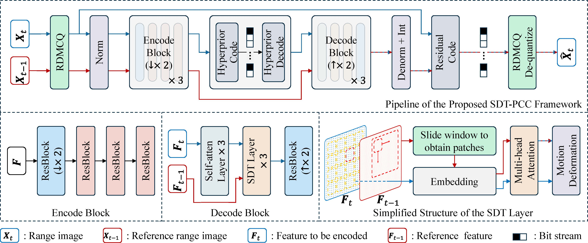

# Slide Deformable Transformer for High-Precision LiDAR Point Cloud Compression

This repository provides the **official implementation** of our paper:

> **Slide Deformable Transformer for High-Precision LiDAR Point Cloud Compression**
> *Under Review*

## 🔍 Introduction

Dynamic LiDAR point cloud compression with range images aims to reduce storage and transmission costs while preserving both **spatial accuracy** and **temporal consistency** across frames.

To tackle the limitations of existing Transformer-based methods—such as feature misalignment under motion displacement and inefficiency of global attention—we propose a new framework, **SDT-PCC**, which integrates:

* **Slide Deformable Transformer (SDT)**:

  * Restricts attention to **local sliding windows**, capturing fine-grained correspondences.
  * Incorporates **deformable convolution** into cross-frame attention for adaptive motion alignment.

* **Radix-Decomposition Multi-Channel Quantizer (RDMCQ)**:

  * Decomposes 16-bit range values into multiple channels.
  * Progressively refines precision across radix levels, mitigating quantization loss.

Experiments on the **SemanticKITTI** dataset demonstrate that SDT-PCC achieves **higher efficiency, temporal coherence, and reconstruction accuracy** compared to existing methods.



---
## ⚙️ Environment Setup

We provide an `environment.yaml` file for reproducibility.

### Create the conda environment:

```bash
conda env create -f environment.yaml -n TO
````

### Activate the environment:

```bash
conda activate TO
```

Please ensure that CUDA and PyTorch versions are compatible with your local GPU setup.

### Install PCC Evaluation Package

For compression performance evaluation, we use our evaluation toolkit:

🔗 [https://github.com/haoranli50/PCCEval](https://github.com/haoranli50/PCCEval)

Clone the repository and install it using:

```bash
git clone https://github.com/haoranli50/PCCEval.git
cd PCCEval
python setup.py install
```

This will install the `pcc_eval` package into the current environment (`TO`), enabling metric evaluation during testing.

---

## 📦 Pretrained Model Preparation

### Download the pretrained model from the following link:

[https://drive.google.com/drive/folders/1lGJkBokKTw83TysPUxjC0Ww7MbJEYrIR?usp=drive_link](https://drive.google.com/drive/folders/1lGJkBokKTw83TysPUxjC0Ww7MbJEYrIR?usp=drive_link)

### Place the downloaded checkpoint file at:

```
checkpoints/20250620_2128/model_best.pth
```

Make sure the directory structure matches exactly; otherwise, the evaluation script may not find the checkpoint automatically.

---

## 🧪 Evaluation

You can directly evaluate the pretrained model using:

```bash
python eval.py -i ~/Dataset/data_odometry_velodyne/dataset/sequences/11/velodyne -s -f 100 -q 0.01
```

### Argument Description

The available arguments in `eval.py` are:

* `-i, --input_dir` (str, required)
  Path to the input point cloud directory (e.g., a KITTI sequence folder containing `.bin` files).

* `--checkpoint` (str, default=None)
  Path to the model checkpoint. If not specified, the default path will be used.

* `-s, --sample` (flag)
  Whether to sample the test data instead of evaluating the entire sequence.

* `-f, --front` (int, default=0)
  Number of samples to take from the beginning of the sequence when sampling is enabled.

* `-b, --beside` (int, default=0)
  Number of samples to take from the end of the sequence when sampling is enabled.

* `-q, --quantize_step` (float, default=0.01)
  Quantization step size used during compression. Smaller values preserve higher precision.

* `-p, --prefix` (str, default=None)
  Prefix for saving output files.

* `-c, --coder` (str, default="zlib")
  Entropy coder used for residual encoding (e.g., `zlib`). Different coders may lead to different compression ratios and runtime performance.

---

## ⚠️ Compatibility Note (CompressAI Version)

Due to differences across `compressai` versions, the strategy for loading CDF buffers may vary.

If you encounter errors when loading the pretrained checkpoint (especially related to CDF tensors), please run:

```bash
python clean_ckpt.py
```

This script clears the stored CDFs inside the checkpoint, allowing them to be rebuilt automatically at runtime.

---

## 🚀 Training Your Own Model

If you wish to train the model from scratch or fine-tune it:

```bash
python ddp_train.py
```

Before training, please configure dataset paths in `config.py`:

* `kitti_train_config`
* `kitti_val_config`

Make sure these paths correctly point to your local KITTI dataset directories.

Distributed Data Parallel (DDP) training is supported. Please ensure your multi-GPU environment is properly configured before launching training.
